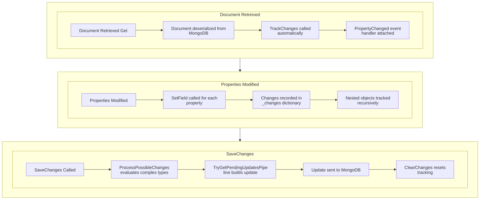

# Change Tracking

MongoObject provides automatic change tracking for efficient MongoDB updates. Only the fields that have changed are sent to the database.

---

## How Change Tracking Works

MongoObject uses the `INotifyPropertyChanged` pattern combined with C# 14 partial properties to detect changes:

```csharp
// When you retrieve a document, tracking is automatically enabled
var user = await monitor.Get(userId);

// Any property change is detected and recorded
user.Name = "New Name";      // Tracked: Name changed
user.Email = "new@test.com"; // Tracked: Email changed

// Only changed fields are sent to MongoDB
await monitor.SaveChanges(user);
// Generates: { $set: { "Document.Name": "New Name", "Document.Email": "new@test.com" } }
```

---

## The TrackingObservableObject Base Class

All generated document classes inherit from `TrackingObservableObject`, which provides:

### Core Features

| Feature | Description |
|---------|-------------|
| `INotifyPropertyChanged` | Standard .NET property change notification |
| Change Dictionary | Records which properties have changed |
| Nested Tracking | Tracks changes in nested objects |
| Pipeline Generation | Creates MongoDB update operations |

### Key Methods

```csharp
public abstract class TrackingObservableObject
{
    // Enable change tracking
    public void TrackChanges();
    
    // Clear recorded changes
    public void ClearChanges();
    
    // Generate MongoDB update pipeline
    public bool TryGetPendingUpdatesPipeline<T>(out UpdateDefinition<MongoDocument<T>>? update);
}
```

---

## What Gets Tracked

### Simple Property Changes

```csharp
user.Name = "Updated";  // Tracked
user.Age = 30;          // Tracked
```

### Setting to Null

```csharp
user.MiddleName = null;  // Tracked as $unset operation
```

### Collection Changes

```csharp
user.Tags.Add("new-tag");        // Tracked (entire collection replaced)
user.Roles.Remove("admin");      // Tracked (entire collection replaced)
```

### Dictionary Changes

```csharp
user.Preferences["theme"] = "dark";  // Tracked (entire dictionary replaced)
```

### Nested Object Changes

```csharp
user.Address.Street = "123 Main St";  // Tracked if Address is also a TrackingObservableObject
```

---

## Generated Update Operations

When you call `SaveChanges()`, MongoObject generates an efficient update pipeline:

### $set Operations

For properties that have been assigned new values:

```csharp
user.Name = "New Name";
user.Age = 25;

// Generates:
// { $set: { "Document.Name": "New Name", "Document.Age": 25 } }
```

### $unset Operations

For properties set to null:

```csharp
user.MiddleName = null;
user.Birthday = null;

// Generates:
// { $unset: ["Document.MiddleName", "Document.Birthday"] }
```

### Automatic Metadata Updates

Every update automatically includes:

```javascript
{
  $set: {
    "Metadata.LastModifiedAt": "$$NOW",
    "Metadata.Version": { $add: [{ $ifNull: ["$Metadata.Version", 0] }, 1] }
  }
}
```

---

## Tracking Lifecycle



---

## Subscribing to Changes

You can subscribe to change notifications:

```csharp
// Subscribe to changes on a specific document
using var subscription = monitor.OnChange(user, () =>
{
    Console.WriteLine("Document changed!");
});

// Make changes
user.Name = "New Name";  // Triggers the callback
```

---

## Efficient Updates Example

```csharp
public async Task UpdateUserEmail(string userId, string newEmail)
{
    // 1. Get the document (tracking enabled)
    var user = await monitor.Get(userId);
    
    // 2. Make the change
    user.Email = newEmail;
    
    // 3. Save only the changed field
    await monitor.SaveChanges(user);
    
    // MongoDB receives:
    // { $set: { "Document.Email": "new@email.com", "Metadata.LastModifiedAt": "$$NOW", ... } }
    // NOT the entire document!
}
```

---

## Best Practices

### 1. Retrieve, Modify, Save

```csharp
// ✓ Recommended pattern
var user = await monitor.Get(id);
user.Name = "New Name";
await monitor.SaveChanges(user);
```

### 2. Batch Multiple Changes

```csharp
// ✓ Make all changes before saving
var user = await monitor.Get(id);
user.Name = "New Name";
user.Email = "new@test.com";
user.Age = 30;
await monitor.SaveChanges(user);  // Single update with all changes
```

### 3. Use Distributed Locks for Concurrent Access

```csharp
// ✓ Lock before modifying
await using var lockScope = await monitor.LockDocument(user);
user.Balance += 100;
await monitor.SaveChanges(user, lockScope);
```

### 4. Avoid Long-Running Tracking

```csharp
// ✗ Don't keep documents tracked for long periods
var user = await monitor.Get(id);
// ... hours later ...
user.Name = "New Name";  // May have stale data

// ✓ Retrieve fresh data when needed
var user = await monitor.Get(id);  // Fresh data
user.Name = "New Name";
await monitor.SaveChanges(user);
```

---

## Next Steps

- **[Metadata](metadata.md)** - Learn about automatic versioning and timestamps
- **[Searching](search/searching.md)** - Query documents efficiently
- **[Dependency Injection](dependency-injection.md)** - Configure tracking options